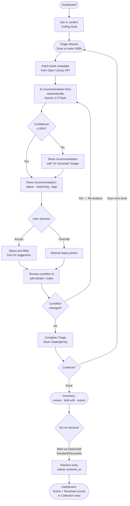

# BookBounty

**Your AI-powered library downsizing consultant.** 

Life transitions—moving into a first apartment, clearing an estate, or downsizing for retirement—are often measured in boxes of books. BookBounty transforms the overwhelming task of library triage into a streamlined, intentional process. Using Gemini 2.5 Flash, it helps you decide what to keep, sell, donate, or discard—one ISBN at a time.

---

[](https://bookbounty-ui.onrender.com/)

## Choose Your Path

Whether you are here to reclaim your shelves, study the fellowship journey, or evaluate the project's institutional future, we have organized our documentation to guide you:

- **[I want to use the app]** Jump to the [Usage Guide](#usage-guide) or [Installation](#installation).
- **[I am a Fellowship Peer]** Explore the [Documentation Guide](docs/DOCUMENTATION_GUIDE.md) to follow the architectural and personal journey.
- **[I am an Investor or Stakeholder]** Review the [V3 Institutional Vision](docs/roadmap/proposals/v3_VISION.md) and [Strategic Memo](docs/strategy/V3_INSTITUTIONAL_MEMO.md).

---

## Table of Contents

1. [What It Does](#what-it-does)
2. [Project Genesis](#project-genesis)
3. [Features](#features)
4. [Workflow](#workflow)
5. [How the AI Works](#how-the-ai-works)
6. [Tech Stack](#tech-stack)
7. [Prerequisites](#prerequisites)
8. [Installation](#installation)
9. [Environment Configuration](#environment-configuration)
10. [Running the App](#running-the-app)
11. [Usage Guide](#usage-guide)
12. [API Reference](#api-reference)
13. [Development](#development)
14. [Project Structure](#project-structure)

---

## What It Does

BookBounty is a multi-tenant web application that helps you work through a personal book collection and decide what to do with each book. Rather than evaluating every title by hand, you define a **Culling Goal** — a plain-language statement of your intent ("I'm moving into a tiny house and need to cut 80% of my collection") — and the AI engine uses that goal as context when analyzing each book you scan.

The result is a fast, opinionated triage loop: scan a barcode, get a recommendation with reasoning, accept it or override it, save the outcome. Repeat until your shelves are clear.

---

## Project Genesis

The idea for this project was born when an academic librarian friend at Pitts Theological Library (Emory University's Candler School of Theology) shared a persistent challenge: processing massive influxes of book donations. While their institutional workflow was clear, the interface to their internal catalog was heavily manual and error-prone. 

Around the time Pursuit issued a mandate to build a workflow automation application, work began on **StewardStack**—a specialized solution designed to help libraries be good stewards of their institutional gifts.

**BookBounty** emerged from that same DNA but with a different, general-use mission. Rather than helping institutions catalog donations, BookBounty helps individuals triage and downsize their personal collections.

### Ideal Users
- **College Students:** Perfect for the end-of-semester purge or post-graduation move, helping students quickly decide which textbooks and novels to keep, sell, or donate.
- **Retirees & Empty Nesters:** Streamlining the emotional and logistical process of downsizing a home library.
- **Estate Executors:** Providing an objective, efficient way to manage and triage a loved one's book collection.
- **Minimalists & Bibliophiles:** Assisting anyone looking to curate a more focused, intentional personal library.

---

## Features

- **Token-based authentication** — secure login page; all API calls require a valid session token
- **Camera-based ISBN scanning** via `html5-qrcode`, with manual entry fallback
- **Automatic book metadata lookup** from the Open Library API (title, author, year, subjects, cover image, description)
- **AI-powered triage recommendations** using Gemini 2.5 Flash — returns status, confidence score, one-sentence reasoning, suggested price, and descriptive tags
- **Culling Goals** — user-defined AI context that shapes every recommendation; preset templates included
- **One-click Accept or manual Override** for every AI suggestion
- **Confidence indicator** — recommendations below 50% confidence are flagged as "AI Uncertain"
- **Re-analyze** — change the condition grade or damage flags and rerun the AI without losing your work
- **Condition grading** — MINT / GOOD / FAIR / POOR with specific damage flags (water damage, torn pages, spine damage, annotated, yellowing)
- **Resolution lifecycle** — mark books as Kept, Sold, Donated, or Discarded; resolved entries leave a permanent record
- **In Collection view** — instantly see what's physically still on your shelves (all unresolved + resolved Keeps)
- **Full inventory management** — search, filter by status or resolution state, view toggles, bulk status updates
- **Export** — CSV, Excel (.xlsx), and PDF
- **Dashboard** with live counts split by active decisions and resolved outcomes
- **Market Valuation & Demo Mode** — fetches real pricing data using the eBay Browse API, with a deterministic mock fallback when `DEMO_MODE=True` is set in the backend environment.

---

## Workflow



---

## How the AI Works

### Culling Goals

Before scanning, you set a **Culling Goal** on the Dashboard. This is a free-text description of your intent, used verbatim as context in every AI prompt during the session. Three preset templates are provided:

| Goal | Intent |
|---|---|
| The Minimalist Transition | Moving to a smaller space; keep only essentials and collectibles |
| The Financial Optimizer | Sell anything worth over $15; donate the rest |
| The Space Maker | Clear a room; keep fiction, purge outdated reference material |

You can write your own goal in plain language. The more specific you are, the more useful the recommendations.

### The Recommendation Engine

Every scan triggers a `POST /api/recommend/` call. The backend:

1. Looks up (or fetches and caches) book metadata from Open Library
2. Builds a structured prompt combining the active Culling Goal, book metadata, and physical condition
3. Calls Gemini 2.5 Flash via the `instructor` library, which enforces a Pydantic schema on the response
4. Returns a `TriageRecommendation` object

**Recommendation schema:**

| Field | Type | Description |
|---|---|---|
| `status` | `KEEP \| DONATE \| SELL \| DISCARD` | Recommended triage outcome |
| `confidence` | `0.0 – 1.0` | How certain the model is |
| `reasoning` | `string` | One-sentence explanation shown to the user |
| `suggested_price` | `float \| null` | Suggested asking price when status is SELL |
| `notable_tags` | `string[]` | Descriptive tags, e.g. `Collectible`, `Outdated`, `First Edition` |

### Confidence and Uncertainty

A confidence score below **0.5** triggers an "AI Uncertain" badge on the recommendation card. This signals that the book is ambiguous relative to your goal — common for books with sparse metadata or mixed signals — and that your judgment is especially needed.

### Rate Limiting

The engine retries automatically up to 3 times on Gemini 429 (rate limit) responses, with exponential backoff (1s, 2s, 4s). If all retries fail, the frontend surfaces a Retry button so you can try again manually.

### Data Persistence

The full `TriageRecommendation` JSON is stored in the `ai_recommendation` field on every `CatalogEntry`. This gives you an audit trail of what the AI suggested versus what status was ultimately saved.

---

## Future Vision: BookBounty V3

The next evolution of BookBounty transforms it from a personal utility into the **Institutional Acquisition Marketplace**. Instead of books simply disappearing into donation bins, the AI engine will identify items with institutional value (special collections, academic archives, rare history) and surface them to libraries actively seeking to grow their collections.

- **Matchmaking Layer:** Connecting individual sellers with registered institutions.
- **Acquisition Pool:** A curated marketplace for books that match specific collection development policies (CDPs).
- **Match Engine:** AI-driven alerts for librarians when a needed book is scanned by a user.

Read the [V3 Institutional Memo](docs/strategy/V3_INSTITUTIONAL_MEMO.md) for more details.

---

## Tech Stack

| Layer | Technology |
|---|---|
| Backend runtime | Python 3.12+ |
| Backend framework | Django 6.x + Django REST Framework |
| Package manager | `uv` |
| Database | PostgreSQL (Production) / SQLite (Dev) |
| AI model | Gemini 2.5 Flash (`gemini-2.5-flash`) |
| AI SDK | `google-genai` + `instructor` (structured outputs) |
| Book metadata | Open Library API |
| Frontend framework | React 19 + Vite |
| UI components | React Bootstrap (Bootstrap 5) |
| HTTP client | Axios |
| Routing | React Router 7 |
| Barcode scanning | `html5-qrcode` |
| Exports | `exceljs` (Excel), `jspdf` (PDF), native CSV |

---

## Prerequisites

- **Python 3.12+**
- **Node.js 18+** and **npm**
- **[uv](https://docs.astral.sh/uv/getting-started/installation/)** — Python package manager used by the backend
- A **Gemini API key** — get one free at [Google AI Studio](https://aistudio.google.com/app/apikey)

---

## Installation

Clone the repository, then set up the backend and frontend separately.

### Backend

```bash
cd backend
uv sync
```

### Frontend

```bash
cd frontend
npm install
```

---

## Environment Configuration

Copy `.env.example` to `.env` in the project root and fill in the required values:

```bash
cp .env.example .env
```

| Variable | Required | Description |
|---|---|---|
| `SECRET_KEY` | Yes | Django secret key. Replace the placeholder before deploying. |
| `DEBUG` | Yes | Set to `True` for local development, `False` in production. |
| `ALLOWED_HOSTS` | Yes | Comma-separated list of allowed hostnames. |
| `CORS_ALLOWED_ORIGINS` | Yes | The frontend origin (e.g. `http://localhost:5173`). |
| `DATABASE_URL` | No | Connection string for a PostgreSQL database. Defaults to local SQLite if omitted. |
| `OPEN_LIBRARY_CONTACT` | Yes | Your email address, included in Open Library API request headers per their usage policy. |
| `GEMINI_API_KEY` | Yes | Your Gemini API key. Required for AI recommendations. Without it, the engine returns a safe KEEP fallback. |
| `EBAY_CLIENT_ID` | No | eBay Browse API Client ID for fetching real market pricing data. |
| `EBAY_CLIENT_SECRET` | No | eBay Browse API Client Secret. |
| `REQUESTS_TIMEOUT` | No | Timeout in seconds for external API calls (Open Library, eBay). Defaults to 10. |
| `VITE_API_BASE_URL` | Yes | The backend API base URL as seen by the browser (e.g. `http://localhost:8000/api`). |
| `DEMO_MODE` | No | Set to `True` to mock market valuation and pricing data. This returns deterministic mock pricing (seeded from ISBN) to simulate real market indicators without hitting external API rate limits. |
| `DJANGO_SUPERUSER_USERNAME` | No | Username for automated superuser creation on first run. |
| `DJANGO_SUPERUSER_EMAIL` | No | Email for automated superuser creation on first run. |
| `DJANGO_SUPERUSER_PASSWORD` | No | Password for automated superuser creation on first run. |

> **Note:** `VITE_API_BASE_URL` is read at **build time** by Vite. If you change it, restart the dev server.

### Running migrations and creating your account

```bash
cd backend
uv run python manage.py migrate
uv run python manage.py createsuperuser
```

`migrate` sets up the SQLite database with all tables. `createsuperuser` creates an initial admin account — BookBounty is multi-tenant, so you can create multiple users.

---

## Running the App

Start both servers. They run independently and communicate via HTTP.

### Backend (Django)

```bash
cd backend
uv run python manage.py runserver
```

Runs at `http://localhost:8000`. The API is available under `/api/`.

### Frontend (Vite / React)

```bash
cd frontend
npm run dev
```

Runs at `http://localhost:5173`. Open this URL in your browser.

---

## Usage Guide

### 1. Set a Culling Goal (Dashboard)

When you first open the app, the Dashboard will show no active goal. Click **+ New Goal**, choose a preset template or write your own, and click **Save & Set Active**. This goal will be sent to the AI as context for every recommendation until you change it.

You can switch goals at any time using the **Change** button — useful if you're triaging books for different purposes in the same session.

### 2. Scan a Book (Triage Wizard)

Click **Start Scanning** from the Dashboard or navigate to **Triage Wizard** in the nav. You can either:

- Allow camera access and point it at the barcode on the book's back cover
- Type or paste the ISBN manually and click **Lookup**

The app fetches the book's metadata from Open Library and immediately fires an AI recommendation in the background.

### 3. Review the AI Recommendation

The **AI Recommendation** card appears while the analysis runs, then shows:

- The suggested status (color-coded: green=Keep, teal=Donate, blue=Sell, red=Discard)
- The one-sentence reasoning
- A confidence bar (turns yellow if confidence is below 50%, with an "AI Uncertain" badge)
- A suggested asking price if the recommendation is SELL
- Descriptive tags

### 4. Accept or Override

- **Accept** — one click applies the AI's suggested status, pre-fills the asking price if applicable, and moves you to the details section
- **Override** — opens the manual status picker; you choose your own status. Click "Use AI suggestion" to revert.

### 5. Condition and Details

Set the **Overall Grade** (Mint / Good / Fair / Poor) and check any **Specific Issues** that apply. If you update the condition, click **Re-analyze** to get a fresh recommendation that takes the new condition into account.

Add an asking price (SELL), donation destination (DONATE), or freeform notes as needed.

### 6. Complete Triage

Click **Complete Triage** to save the entry. You'll see a confirmation screen with options to scan the next book or jump to the Inventory.

### 7. Resolve Decisions (Inventory)

When you've physically acted on a book — sold it, dropped it at Goodwill, kept it on the shelf — mark it as resolved in the **Inventory**. Click the action button on any pending row to stamp it as **Kept**, **Sold**, **Donated**, or **Discarded**. Resolved entries stay in the database as a permanent record and are shown in a muted style with the resolution date.

### 8. Inventory Management

The **Inventory** page shows all cataloged entries with four view modes:

- **All** — every entry in the database
- **In Collection** — books physically still present (all unresolved + resolved Keeps)
- **Pending** — decisions not yet acted upon
- **Resolved** — entries that have been marked done

You can also:

- Search by title or author
- Filter by status
- Select multiple entries and bulk-update their status
- Export the full list (or current filtered view) as CSV, Excel, or PDF

---

## API Reference

All endpoints are prefixed with `/api/`. All endpoints except auth require a valid token (`Authorization: Token <key>`).

### Authentication

| Method | Endpoint | Description |
|---|---|---|
| `POST` | `/auth/login/` | Login — returns `{"key": "..."}` |
| `POST` | `/auth/logout/` | Invalidate the current token |

### Books & Triage

| Method | Endpoint | Description |
|---|---|---|
| `GET` | `/lookup/{isbn}/` | Fetch and cache book metadata from Open Library; includes `metadata_found` flag |
| `GET` | `/goals/` | List all culling goals |
| `POST` | `/goals/` | Create a new culling goal |
| `PATCH` | `/goals/{id}/` | Update a goal (`is_active: true` deactivates all others) |
| `POST` | `/recommend/` | Get an AI triage recommendation |
| `GET` | `/entries/` | List catalog entries (see query params below) |
| `POST` | `/entries/` | Create a new catalog entry |
| `PATCH` | `/entries/{id}/` | Update a catalog entry |
| `DELETE` | `/entries/{id}/` | Delete a catalog entry record |
| `POST` | `/entries/{id}/resolve/` | Mark entry as resolved — stamps `resolved_at` (400 if already resolved) |
| `PATCH` | `/entries/bulk_update_status/` | Bulk-update status: `{"ids": [...], "status": "SELL"}` |
| `GET` | `/stats/` | Dashboard counts: `{active: {...}, resolved: {...}, in_collection: N}` |

### `GET /entries/` query params

| Param | Values | Description |
|---|---|---|
| `?status=` | `KEEP\|DONATE\|SELL\|DISCARD` | Filter by triage status |
| `?search=` | any string | Case-insensitive match on title or author |
| `?resolved=` | `true\|false` | Filter by resolution state |
| `?in_collection=` | `true` | Books physically still present (unresolved + resolved Keeps) |

### `POST /recommend/` payload and response

```json
{
  "isbn": "9780374528379",
  "culling_goal_id": 1,
  "condition_grade": "GOOD",
  "condition_flags": ["TORN_PAGES"]
}
```

`culling_goal_id`, `condition_grade`, and `condition_flags` are all optional. If `culling_goal_id` is omitted, the active goal is used automatically.

```json
{
  "status": "SELL",
  "confidence": 0.87,
  "reasoning": "A sought-after first edition in good condition; aligns with your Financial Optimizer goal.",
  "suggested_price": 45.00,
  "notable_tags": ["First Edition", "Collectible"]
}
```

---

## Development

All commands assume you're in the appropriate subdirectory.

### Backend

```bash
# Run tests
uv run python manage.py test

# Lint (check only)
uv run ruff check .

# Lint (auto-fix)
uv run ruff check . --fix

# Type checking
uv run mypy .

# Create a new migration after model changes
uv run python manage.py makemigrations
uv run python manage.py migrate
```

### Frontend

```bash
# Lint
npm run lint

# Format
npx prettier --write .

# Production build
npm run build
```

### Code style

- **Backend:** Google-style docstrings, strict `mypy` type hints, `ruff` for linting and formatting
- **Frontend:** ESLint + Prettier; React Bootstrap components over raw HTML

---

## Project Structure

```
book-bounty/
├── backend/
│   ├── core/                   # Django project config and settings
│   ├── triage/
│   │   ├── ai_engine.py        # Gemini 2.5 Flash integration + TriageRecommendation schema
│   │   ├── models.py           # Book, CatalogEntry, CullingGoal
│   │   ├── serializers.py      # DRF serializers
│   │   ├── services.py         # Open Library API client + book caching logic
│   │   ├── views.py            # API views and viewsets
│   │   ├── urls.py             # URL routing
│   │   └── migrations/
│   └── pyproject.toml          # Python dependencies (managed by uv)
│
├── frontend/
│   └── src/
│       ├── components/
│       │   └── Layout.jsx      # Nav + page shell + sign-out
│       ├── pages/
│       │   ├── Login.jsx       # Token auth login form
│       │   ├── Dashboard.jsx   # Stats overview + Culling Goal management
│       │   ├── TriageWizard.jsx # Scan → AI recommend → accept/override → save
│       │   └── Inventory.jsx   # Filterable catalog table, resolution, exports
│       └── services/
│           └── api.js          # Axios API client with token interceptor
│
├── docs/
│   ├── architecture/           # Living strategy (Vision, AI Spec, Orchestration, Deployment)
│   │   └── DEPLOYMENT.md       # Render Blueprint deployment checklist
│   ├── marketing/              # Elevator pitch, demo scripts, and brand assets
│   ├── strategy/               # Competitor analysis and investor ROI
│   ├── staff/                  # Multi-agent team context (Personas, Directives, Reflection)
│   ├── roadmap/                # Planning (Proposals and completed phase archives)
│   └── fellowship/             # User's personal fellowship workspace
├── .env.example                # Environment variable template
├── CLAUDE.md                   # Project context for Claude Code
├── GEMINI.md                   # Project context for Gemini CLI
└── README.md                   # This file
```

---

## Fellowship Workspace

The `docs/fellowship/` directory is reserved for the user's personal fellowship-related reflections, research, and deliverables. This workspace is integrated into the project for ease of access but is semantically separated from technical specifications.
