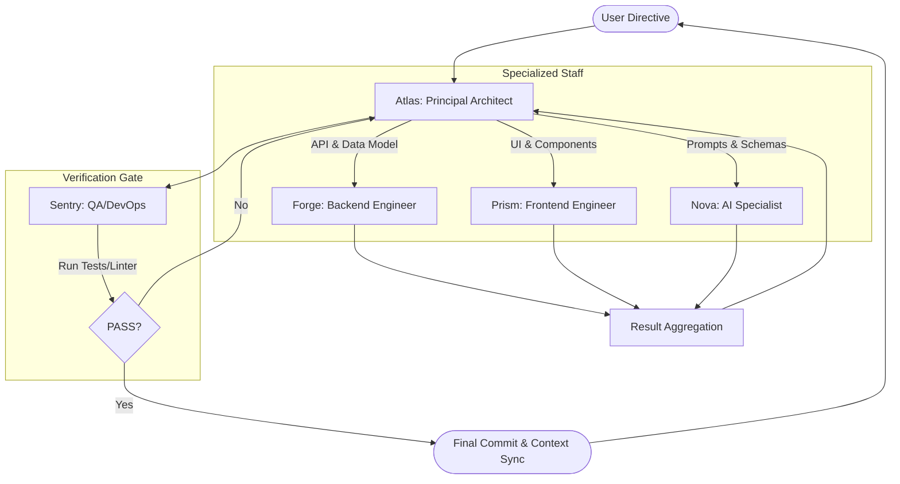

# Multi-Agent Orchestration Strategy: BookBounty

This document outlines an optimized workflow for building BookBounty using a specialized multi-agent "staff." It analyzes current workflow efficiencies and proposes a delegation model to maximize context efficiency and technical integrity.

---

## 1. Workflow Audit: Gemini & Claude

### Current Efficiencies
- **Context Synchronization:** Using `GEMINI.md` and `CLAUDE.md` as "long-term memory" files works well for maintaining project state across sessions.
- **Surgical Edits:** The `replace` tool is highly effective for targeted changes, minimizing context noise.
- **Remediation Loop:** The recent "Senior Dev Audit" successfully identifies technical debt before it compounds.

### Friction Points
- **Shell Discrepancy:** Previous failures caused by using Bash syntax in PowerShell environments (resolved via explicit documentation).
- **Context Bloat:** As the app grows, monolithic components (like the original `TriageWizard.jsx`) force agents to ingest too much irrelevant code to make small changes.
- **Persona Context:** Generalist agents often "forget" specific engineering standards (like Google-style docstrings or specific React-Bootstrap patterns) unless prompted repeatedly.

---

## 2. The Ideal Staff (Agent Personas)

To continue building BookBounty efficiently, I would orchestrate the following specialized agents:

| Agent | Persona | Primary Focus |
|---|---|---|
| **Atlas** | **Principal Architect** | High-level design, cross-stack integration, security mandates, and documentation/context synchronization. (Current Gemini Role) |
| **Forge** | **Backend Specialist** | Django ORM, REST API design, database migrations, and complex business logic in `triage/services.py`. |
| **Prism** | **UX/Frontend Architect** | React component design, Bootstrap consistency, accessibility (A11y), and state management logic. |
| **Nova** | **AI Engine Specialist** | Gemini prompt engineering, `instructor` schema validation, and third-party API resilience (Open Library). |
| **Sentry** | **QA & DevOps Specialist** | Unit testing (Python/Django), shell command abstraction, environment sanity checks, and linting enforcement. |

---

## 3. Orchestration & Delegation Strategy

As **Atlas**, I act as the orchestrator. My goal is to keep the "working context" of sub-agents as small as possible to ensure speed and accuracy.

### The Delegation Loop
1.  **Directive:** User provides a high-level goal (e.g., "Add Valuation History").
2.  **Breakdown (Atlas):** I decompose the goal into sub-tasks (Backend, Frontend, AI).
3.  **Specialized Execution:**
    - **Forge** is given only the `models.py` and `serializers.py` to add the new fields.
    - **Prism** is given only the new API spec and the `Dashboard.jsx` to build the UI.
4.  **Verification (Sentry):** Once execution is done, Sentry runs tests and linters to ensure zero regressions.
5.  **Synchronization (Atlas):** I update the context documents (`GEMINI.md`, `CLAUDE.md`) and report back to the user.

---

## 4. Orchestration Diagram

---

## 5. Efficiency Gains
- **Reduced Token Usage:** Sub-agents only see the files strictly necessary for their task.
- **Parallelism:** Forge and Prism can theoretically work in parallel if their tasks are decoupled by a pre-defined API contract.
- **Higher Quality:** Sentry's dedicated focus on "breaking" the code ensures that optimizations (like the recent N+1 query fix) are verified and never reverted by accident.
