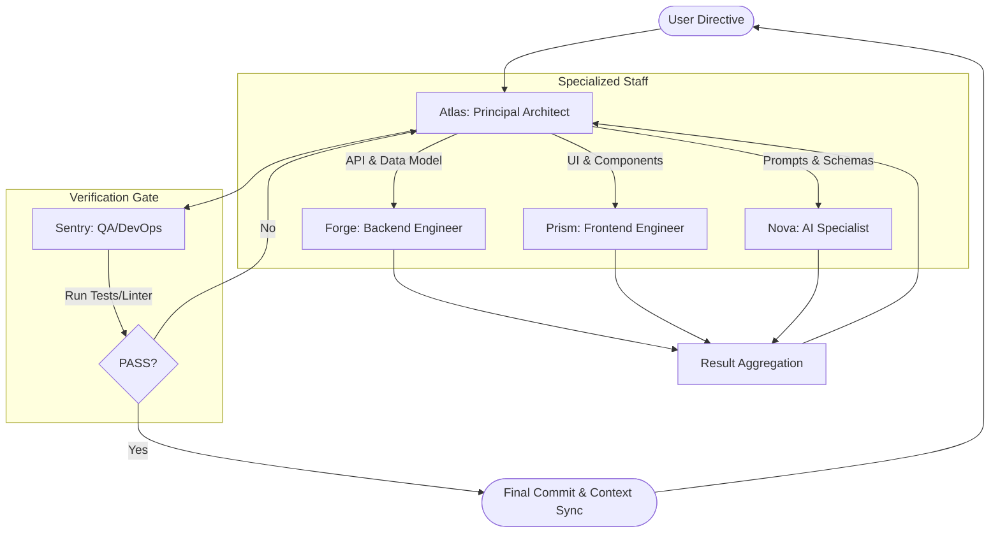

# Multi-Agent Orchestration Strategy: BookBounty

This document outlines an optimized workflow for building BookBounty using a specialized multi-agent "staff." It analyzes current workflow efficiencies and proposes a delegation model to maximize context efficiency and technical integrity.

---

## 1. Workflow Audit: Gemini & Claude

### Current Efficiencies
- **Context Synchronization:** Using `GEMINI.md` and `CLAUDE.md` as "long-term memory" files works well for maintaining project state across sessions.
- **Surgical Edits:** The `replace` tool is highly effective for targeted changes, minimizing context noise.
- **Remediation Loop:** The recent "Senior Dev Audit" successfully identifies technical debt before it compounds.

### Friction Points
- **Shell Discrepancy:** Previous failures caused by using Bash syntax in PowerShell environments (resolved via explicit documentation).
- **Context Bloat:** As the app grows, monolithic components (like the original `TriageWizard.jsx`) force agents to ingest too much irrelevant code to make small changes.
- **Persona Context:** Generalist agents often "forget" specific engineering standards (like Google-style docstrings or specific React-Bootstrap patterns) unless prompted repeatedly.

---

## 2. The Ideal Staff (Agent Personas)

To continue building BookBounty efficiently, I would orchestrate the following specialized agents:

| Agent | Persona | Primary Focus |
|---|---|---|
| **Atlas** | **Principal Architect** | High-level design, cross-stack integration, security mandates, and documentation/context synchronization. (Current Gemini Role) |
| **Forge** | **Backend Specialist** | Django ORM, REST API design, database migrations, and complex business logic in `triage/services.py`. |
| **Prism** | **UX/Frontend Architect** | React component design, Bootstrap consistency, accessibility (A11y), and state management logic. |
| **Nova** | **AI Engine Specialist** | Gemini prompt engineering, `instructor` schema validation, and third-party API resilience (Open Library). |
| **Sentry** | **QA & DevOps Specialist** | Unit testing (Python/Django), shell command abstraction, environment sanity checks, and linting enforcement. |

---

## 3. Orchestration & Delegation Strategy

As **Atlas**, I act as the orchestrator. My goal is to keep the "working context" of sub-agents as small as possible to ensure speed and accuracy.

### The Delegation Loop
1.  **Directive:** User provides a high-level goal (e.g., "Add Valuation History").
2.  **Breakdown (Atlas):** I decompose the goal into sub-tasks (Backend, Frontend, AI).
3.  **Specialized Execution:**
    - **Forge** is given only the `models.py` and `serializers.py` to add the new fields.
    - **Prism** is given only the new API spec and the `Dashboard.jsx` to build the UI.
4.  **Verification (Sentry):** Once execution is done, Sentry runs tests and linters to ensure zero regressions.
5.  **Synchronization (Atlas):** I update the context documents (`GEMINI.md`, `CLAUDE.md`) and report back to the user.

---

## 4. Orchestration Diagram

---

## 5. Persona Memory (Localized Context)

In addition to project-wide documentation, each agent maintains a localized memory file in `docs/orchestration/personae/`. These files store:
- **Specific Mandates:** Granular engineering standards relevant only to that persona.
- **Feedback Log:** A history of lessons learned, avoided pitfalls, and stylistic preferences.
- **Architectural Guardrails:** Decisions made by Atlas that constrain the specialist's domain.

This prevents the "Generalist Amnesia" common in long sessions and ensures that feedback like "Use conditional aggregation for stats" (Forge) or "Always add keyboard listeners to div buttons" (Prism) is never lost.

---

## 6. Efficiency Gains
- **Reduced Token Usage:** Sub-agents only see the files strictly necessary for their task.
- **Parallelism:** Forge and Prism can theoretically work in parallel if their tasks are decoupled by a pre-defined API contract.
- **Higher Quality:** Sentry's dedicated focus on "breaking" the code ensures that optimizations (like the recent N+1 query fix) are verified and never reverted by accident.

---

## 7. Efficiency Benchmarks (Audited 2026-04-09)

Measured against 29 sessions logged across the first 3 days of active development. Wall-clock times measured on the live dev machine.

### Measured invocation costs

| Invocation | Wall clock |
|---|---|
| Sentry `full` (46 backend tests + ESLint) | **57s** |
| Sentry `backend` (tests + ruff only) | **~40s** |
| Sentry `frontend` (ESLint only) | **19s** |
| Archivist (cold start + file reads + write) | **~60s** (estimated) |

### Six optimizations and their savings

**1. Sentry modes (`full` / `backend` / `frontend` / `skip`)**

Classifying the 29 historical sessions: 10 were doc-only (now `skip`), 5 backend-only (now `backend` mode), 1 frontend-only, 13 full-stack.

- 10 doc-only sessions × 57s eliminated = **570s**
- 5 backend-only sessions × 17s saved (no frontend lint) = **85s**
- 1 frontend-only session × 38s saved (no backend tests) = **38s**
- **Subtotal: 693s (~11.5 min) historically; ~22s saved per average future session**

**2. Archivist fires once at session end (not after every wave)**

Multi-wave sessions previously triggered one Archivist invocation per wave. Estimated old invocation count across 29 sessions: ~51. New: 29 (one per session).

- 22 eliminated invocations × 60s = **1,320s (~22 min) historically**
- **~120s (~2 min) saved per typical 3-wave future session**

**3. Inline excerpts (no double file reads)**

When Atlas has already read a file during task decomposition, it excerpts the relevant section into the specialist's prompt rather than asking the specialist to re-read the full file.

Key files and estimated savings per avoided re-read:

| File | Est. tokens (full) | Typical excerpt | Tokens saved |
|---|---|---|---|
| `backend/triage/views.py` | ~1,600 | ~120 | ~1,480 |
| `frontend/src/pages/Inventory.jsx` | ~2,000 | ~160 | ~1,840 |
| `frontend/src/pages/TriageWizard.jsx` | ~1,600 | ~160 | ~1,440 |
| `backend/triage/serializers.py` | ~600 | ~80 | ~520 |

`views.py` was the primary Forge target in ~12 sessions. Estimated total: **~25,000 tokens** saved historically. ~1,500–3,000 tokens per future session.

**4. Complexity threshold (inline for simple fixes)**

Tasks under ~15 lines of change, touching ≤ 2 files, with no architectural judgment are handled inline by Atlas rather than spawning a subagent. Subagent overhead per invocation: ~10–15s cold start + ~120 tokens (persona file read).

~3–4 clearly eligible sessions historically: **~35s + ~480 tokens** saved. Primary value is session cleanliness, not raw numbers.

**5. Wave batching (Sentry once across consecutive low-risk waves)**

Multi-wave sessions with additive, non-overlapping changes batch Sentry to run once at session end. High-risk waves (schema changes, auth changes, permission changes) still trigger immediate per-wave Sentry.

| Session | Old Sentry runs | New | Saved |
|---|---|---|---|
| Phase 10, UX Audit (4 waves each, low risk) | 4 each | 1 each | 3 × 57s = **171s each** |
| Phase 8 (3 waves, additive) | 3 | 1 | 2 × 57s = **114s** |
| Phase 5, 6 (3 waves each) | 3 each | 1 each | 2 × 57s = **114s each** |
| Phase 7 (4 waves, mixed risk) | 4 | 2 | 2 × 57s = **114s** |

- **~969s (~16 min) historically**
- **~114s (~2 min) per typical 3-wave low-risk future session**

**6. Pre-Sentry ritual (required self-check line)**

Atlas must output `"Pre-Sentry check: [files reviewed] — [finding or clean]"` before every Sentry invocation. Catches visible regressions before they burn a Sentry cycle. Phase 5 logged two Sentry rejections that a pre-check likely would have caught: ~114–228s averted. Primary value is quality enforcement, not resource saving.

### Aggregate

| Change | Wall-clock saved (29 sessions) | Tokens saved (29 sessions) |
|---|---|---|
| Sentry modes | 693s | — |
| Archivist session-end | 1,320s | — |
| Inline excerpts | — | ~25,000 |
| Complexity threshold | ~35s | ~480 |
| Wave batching | ~969s | — |
| Pre-Sentry ritual | ~170s | — |
| REFLECTION.md compression (374→49 lines) | — | ~75,400 (future reads) |
| **Total** | **~3,187s (~53 min)** | **~101,000 tokens** |

### Per-session projection (going forward)

Assuming a typical 3-wave mixed-risk session:

| Change | Saving |
|---|---|
| Sentry modes | ~22s |
| Archivist session-end | ~120s |
| Wave batching | ~114s |
| Inline excerpts | ~2,000 tokens |
| Complexity threshold | ~12s, ~120 tokens |
| REFLECTION.md compression | ~2,600 tokens |
| **Total** | **~268s (~4.5 min), ~4,720 tokens per session** |

### Caveats
- Archivist timing (~60s) is estimated, not measured. Actual range is likely 30–90s depending on session size.
- Wave counts for older sessions are inferred from session descriptions, not transcripts.
- Token figures use ~4 tokens/line as a working approximation.
- Pre-Sentry ritual savings are behavioral — they only materialize if the mandate is followed.
- These savings compound: every future session benefits from the per-session figures above.
